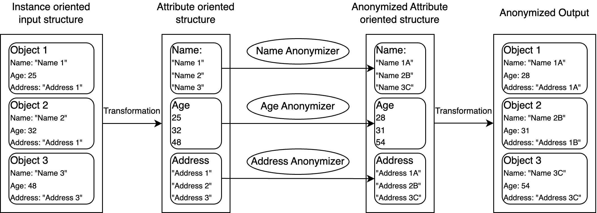
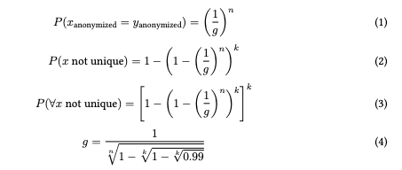
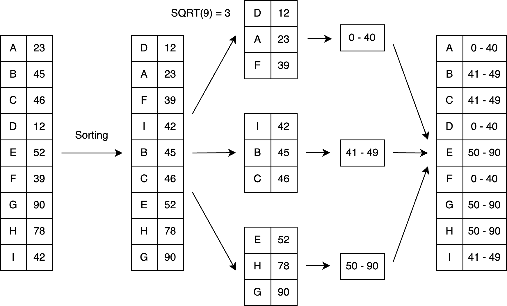
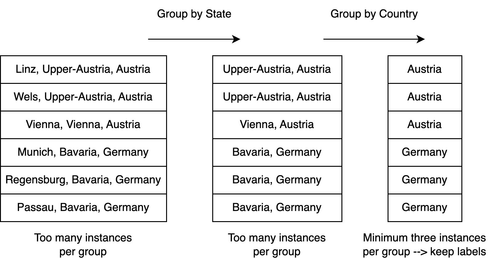

# Anonymization Service

### General Idea
- Service that anonymizes personal data in JSON and JSON-LD using a configuration-driven approach.
- Purpose: Reduce re-identification risk and support GDPR compliance.
- Input: Source data plus an anonymization configuration.
  - Supported formats: JSON-LD or flat JSON.
  - Output mirrors the input format (JSON-LD in → JSON-LD out; flat JSON in → flat JSON out).
- Ontology-backed: A hosted ontology defines which anonymization operations are permitted for each attribute based on its type and datatype.
  - Supports heterogeneous object types; each type must have a corresponding anonymization strategy.
- Attribute oritented anonymization: During processing, the service builds an anonymizer for each attribute to select the most suitable operations under the defined constraints.
- Implemented anonymization methods are described below.
- API documentation (Swagger UI): https://anonymizer.go-data.at/swagger-ui/index.html#/

### Anonymization Process
The anonymization workflow comprises the following steps:
- Fetch the configuration
- Extract the configuration from the knowledge graph
- Create anonymizers for each attribute
- Generate anonymized values and add them to the input model
- Remove original values for attributes with defined anonymization
- Construct the output

#### Fetch Configuration
The service fetches the configuration from the provided URL. The configuration must be a JSON-LD knowledge graph. After retrieval, the payload is validated to ensure it is well-formed JSON-LD.

#### Extract Configuration
From the knowledge graph, the service identifies the object types defined in the ontology and extracts the attribute-specific settings for each type. Each attribute is characterized by:
- Its datatype
- The anonymization strategy to apply

#### Create Anonymizers
If the configuration is valid, an anonymizer is instantiated for each attribute with a supported combination of strategy and datatype. If the requested combination is not implemented, the attribute is skipped and no anonymization is applied to it. This step yields a list (or per-type map) of anonymizers that can be applied to anonymize each attribute.

#### Apply Anonymizers
To apply the anonymizers, the input data is normalized. For each object type, the service collects values for every attribute across all instances and applies the corresponding anonymizer to these value lists. The anonymized values are then written back to the respective instances.

#### Remove Original Values
For attributes that are anonymized, the original values are removed from the knowledge graph.

#### Construct Output
If the output is requested as a knowledge graph, the model is returned as JSON-LD. If a flat JSON output is requested, a flat JSON representation is produced.



### Anonymization Operations

The service is designed for easy integration of new anonymization operations. To integrate new anonymizer, the interface must be implemented

#### Number of Buckets

Generalization and randomization require a bucket count (g). This value is derived from the number of instances (k) in the dataset and the number of anonymized attributes (n). The calculation ensures at least a 99% probability that no individual in the dataset is uniquely identifiable.

- Line 1: Probability that two individuals share the same anonymized values across all attributes.
- Line 2: Probability that a given individual is not unique (at least one other individual has the same anonymized attribute values).
- Line 3: Probability that no individual in the dataset is unique.
- Line 4: Bucket count g computed by rearranging the formula from Line 3 to ensure, with ≥99% probability, that all individuals are non-unique.



#### Masking

Masking fully hides attribute values. The original value is replaced with the masking string "*****". This guarantees complete anonymization, but removes all information about the underlying data. Masking can be applied to any datatype.

Example: Name: "Peter Parker" → Name: "*****"

#### Generalization

Generalization groups attribute values into buckets and writes the bucket label to the anonymized dataset. The number of buckets is defined by the dataset size:

nrBuckets = sqrt(numberInstances)

Values are sorted and assigned to buckets so that each bucket contains the same number of values. This avoids creating singleton buckets for outliers, which would make those records easily distinguishable. Bucket labels are then derived from the values within each bucket.



##### Generalization for Objects

Generalization is also supported for object data when a hierarchical relationship exists between attributes. These object attributes must be defined in the configuration. The process iteratively reduces each data point to its corresponding attribute value, starting from the lowest level in the hierarchy.

If the mapping at the current level achieves sufficient anonymization, those attribute values are returned as the anonymized output. Otherwise, the process continues to the next level in the hierarchy. If anonymization still cannot be achieved at the highest level, masking is applied as a fallback.

Currently, “sufficient anonymization” at any level means each group contains at least three data points.

Example: Addresses
- City level: Six groups with only one value each → insufficient.
- State level: Three groups formed, but two have fewer than three values → insufficient.
- Country level: Each group contains at least three values → used for output.



#### Randomization

Randomization adds noise to each data point. The noise follows a normal distribution, with its scale depending on the number of instances, the data distribution, and the bucket count. Specifically, the added “salt” is a draw from a normal distribution multiplied by the distance to the i-th nearest value, where i is the number of instances per bucket. This scales the noise to the local density of the data while preserving anonymization strength.
https://anonymizer.go-data.at/swagger-ui/index.html#/

<details><summary>Anonymization Json-LD</summary>

PUT /api/anonymise

* Input
```json
{
  "configurationUrl": "https://soya.ownyourdata.eu/AnonymisationDemo",
  "data": {
    "@context": {
      "oyd": "https://soya.ownyourdata.eu/AnonymisationDemo/"
    },
    "@graph": [
      {
        "@id": "oyd:test1",
        "@type": "oyd:AnonymisationDemo",
        "oyd:latitude": 1234,
        "oyd:longitude": 1234,
        "oyd:geburtsdatum": {
          "@value": "2023-10-01",
          "@type": "xsd:date"
        }
      },
      {
        "@id": "oyd:test2",
        "@type": "oyd:AnonymisationDemo",
        "oyd:geburtsdatum": "1999-10-01"
      },
      {
        "@id": "oyd:test3",
        "@type": "oyd:AnonymisationDemo",
        "oyd:latitude": 12,
        "oyd:longitude": 125,
        "oyd:geburtsdatum": {
          "@value": "2020-10-01",
          "@type": "xsd:date"
        }
      },
      {
        "@id": "oyd:test4",
        "@type": "oyd:AnonymisationDemo",
        "oyd:latitude": 123,
        "oyd:longitude": 12,
        "oyd:geburtsdatum": {
          "@value": "2027-10-01",
          "@type": "xsd:date"
        }
      },
      {
        "@id": "oyd:test5",
        "@type": "oyd:AnonymisationDemo",
        "oyd:latitude": 1234,
        "oyd:longitude": 1234,
        "oyd:geburtsdatum": {
          "@value": "2021-10-01",
          "@type": "xsd:date"
        }
      },
      {
        "@id": "oyd:test6",
        "@type": "oyd:AnonymisationDemo",
        "oyd:latitude": 1,
        "oyd:longitude": 3213
      },
      {
        "@id": "oyd:test7",
        "@type": "oyd:AnonymisationDemo",
        "oyd:latitude": 12,
        "oyd:longitude": 534
      },
      {
        "@id": "oyd:test8",
        "@type": "oyd:AnonymisationDemo",
        "oyd:latitude": 123,
        "oyd:longitude": 124
      },
      {
        "@id": "oyd:test9",
        "@type": "oyd:AnonymisationDemo",
        "oyd:latitude": 123,
        "oyd:longitude": 213
      }
    ]
  }
}
```

* Response
```json
{
  "@graph": [
    {
      "@id": "oyd:test7",
      "oyd:latitude_generalized": {
        "@id": "oyd:latitude_0"
      },
      "oyd:longitude_randomized": {
        "@value": "-1386.0220515164428",
        "@type": "http://www.w3.org/2001/XMLSchema#double"
      },
      "@type": "oyd:AnonymisationDemo"
    },
    {
      "@id": "oyd:latitude_0",
      "http://www.w3.org/2000/01/rdf-schema#max": {
        "@value": "1234.0",
        "@type": "http://www.w3.org/2001/XMLSchema#double"
      },
      "http://www.w3.org/2000/01/rdf-schema#min": {
        "@value": "1.0",
        "@type": "http://www.w3.org/2001/XMLSchema#double"
      },
      "http://www.w3.org/1999/02/22-rdf-syntax-ns#type": "http://ns.ownyourdata.eu/ns/soya-context/generalization"
    },
    {
      "@id": "oyd:test9",
      "oyd:latitude_generalized": {
        "@id": "oyd:latitude_0"
      },
      "oyd:longitude_randomized": {
        "@value": "-248.20239927675317",
        "@type": "http://www.w3.org/2001/XMLSchema#double"
      },
      "@type": "oyd:AnonymisationDemo"
    },
    {
      "@id": "oyd:test2",
      "oyd:geburtsdatum_randomized": {
        "@value": "2052-12-07T00:46:22Z",
        "@type": "http://www.w3.org/2001/XMLSchema#dateTime"
      },
      "@type": "oyd:AnonymisationDemo"
    },
    {
      "@id": "http://ns.ownyourdata.eu/ns/soya-context/kpiObject",
      "http://ns.ownyourdata.eu/ns/soya-context/kAnonymity": {
        "@value": "1",
        "@type": "http://www.w3.org/2001/XMLSchema#long"
      },
      "http://ns.ownyourdata.eu/ns/soya-context/latitudeNumberAttributes": {
        "@value": "1",
        "@type": "http://www.w3.org/2001/XMLSchema#long"
      },
      "http://ns.ownyourdata.eu/ns/soya-context/geburtsdatumNumberAttributes": {
        "@value": "1",
        "@type": "http://www.w3.org/2001/XMLSchema#long"
      },
      "http://ns.ownyourdata.eu/ns/soya-context/longitudeNumberAttributes": {
        "@value": "1",
        "@type": "http://www.w3.org/2001/XMLSchema#long"
      }
    },
    {
      "@id": "oyd:test4",
      "oyd:latitude_generalized": {
        "@id": "oyd:latitude_0"
      },
      "oyd:longitude_randomized": {
        "@value": "-1976.144686999923",
        "@type": "http://www.w3.org/2001/XMLSchema#double"
      },
      "oyd:geburtsdatum_randomized": {
        "@value": "2007-04-09T08:52:41Z",
        "@type": "http://www.w3.org/2001/XMLSchema#dateTime"
      },
      "@type": "oyd:AnonymisationDemo"
    },
    {
      "@id": "oyd:test6",
      "oyd:latitude_generalized": {
        "@id": "oyd:latitude_0"
      },
      "oyd:longitude_randomized": {
        "@value": "3154.139710318729",
        "@type": "http://www.w3.org/2001/XMLSchema#double"
      },
      "@type": "oyd:AnonymisationDemo"
    },
    {
      "@id": "oyd:test8",
      "oyd:latitude_generalized": {
        "@id": "oyd:latitude_0"
      },
      "oyd:longitude_randomized": {
        "@value": "-1419.0737499878442",
        "@type": "http://www.w3.org/2001/XMLSchema#double"
      },
      "@type": "oyd:AnonymisationDemo"
    },
    {
      "@id": "oyd:test1",
      "oyd:latitude_generalized": {
        "@id": "oyd:latitude_0"
      },
      "oyd:longitude_randomized": {
        "@value": "-2118.1293242625266",
        "@type": "http://www.w3.org/2001/XMLSchema#double"
      },
      "oyd:geburtsdatum_randomized": {
        "@value": "2001-11-07T15:46:28Z",
        "@type": "http://www.w3.org/2001/XMLSchema#dateTime"
      },
      "@type": "oyd:AnonymisationDemo"
    },
    {
      "@id": "oyd:test3",
      "oyd:latitude_generalized": {
        "@id": "oyd:latitude_0"
      },
      "oyd:longitude_randomized": {
        "@value": "40.64317785669989",
        "@type": "http://www.w3.org/2001/XMLSchema#double"
      },
      "oyd:geburtsdatum_randomized": {
        "@value": "2001-10-04T08:54:33Z",
        "@type": "http://www.w3.org/2001/XMLSchema#dateTime"
      },
      "@type": "oyd:AnonymisationDemo"
    },
    {
      "@id": "oyd:test5",
      "oyd:latitude_generalized": {
        "@id": "oyd:latitude_0"
      },
      "oyd:longitude_randomized": {
        "@value": "68.85618799322356",
        "@type": "http://www.w3.org/2001/XMLSchema#double"
      },
      "oyd:geburtsdatum_randomized": {
        "@value": "2005-06-26T08:00:50Z",
        "@type": "http://www.w3.org/2001/XMLSchema#dateTime"
      },
      "@type": "oyd:AnonymisationDemo"
    }
  ],
  "@context": {
    "oyd": "https://soya.ownyourdata.eu/AnonymisationDemo/"
  }
}
```
</details>
<details><summary>Anonymization Flat Json</summary>
PUT /api/anonymise/flatjson
  
* Input
```json
{
  "configurationUrl": "https://soya.ownyourdata.eu/AnonymisationDemo",
  "prefix": "https://soya.ownyourdata.eu/AnonymisationDemo/",
  "data": [
    {
      "latitude": 1234,
      "longitude": 1234,
      "test_attribute_not_anonymized": "test"
    },
    {
      "latitude": 123,
      "longitude": 12334
    },
    {
      "latitude": 1221,
      "longitude": 1234
    },
    {
      "latitude": 123,
      "longitude": 12534
    },
    {
      "latitude": 1,
      "longitude": 34
    }
  ]
}
```

* Response
```json
{
  "data": [
    {
      "test_attribute_not_anonymized": "test",
      "longitude_randomized": "-2816.9047756120394",
      "latitude_generalized": {
        "min": "1.0",
        "max": "1234.0"
      }
    },
    {
      "longitude_randomized": "12126.780841320124",
      "latitude_generalized": {
        "min": "1.0",
        "max": "1234.0"
      }
    },
    {
      "longitude_randomized": "-7660.957338690734",
      "latitude_generalized": {
        "min": "1.0",
        "max": "1234.0"
      }
    },
    {
      "longitude_randomized": "5745.373161057553",
      "latitude_generalized": {
        "min": "1.0",
        "max": "1234.0"
      }
    },
    {
      "longitude_randomized": "-15832.739270047625",
      "latitude_generalized": {
        "min": "1.0",
        "max": "1234.0"
      }
    }
  ],
  "kpis": {
    "kAnonymity": "3",
    "latitudeNumberAttributes": "1",
    "longitudeNumberAttributes": "1"
  }
}
```
</detail>
